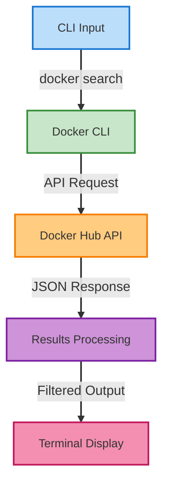

# 🐳 Docker Search Command Reference

[](https://github.com/TheToriqul/docker-search-command)
[](https://github.com/TheToriqul/docker-search-command/stargazers)


## 📋 Overview

A comprehensive reference guide for Docker search commands, focusing on practical CLI usage patterns and advanced filtering techniques. This project documents my deep dive into Docker Hub's search capabilities, helping developers efficiently locate and evaluate Docker images for their projects.

## 🏗 Technical Architecture

The Docker search command interfaces directly with Docker Hub's API, providing a streamlined way to search for container images from the command line.



## 💻 Technical Stack

- Docker CLI: Advanced search capabilities
- Shell Scripting: Command organization and documentation
- Docker Hub API: Remote repository interaction
- Terminal Tools: Output formatting and filtering

## ⭐ Key Features

1. Basic Search Operations
   - Repository name searching
   - Description-based queries
   - Result limitation controls

2. Advanced Filtering
   - Official image filtering
   - Star-based filtering
   - Automated build filtering

3. Output Formatting
   - Structured display
   - Column-based sorting
   - Custom limit handling

4. Search Optimization
   - Efficient query patterns
   - Performance considerations
   - Best practices implementation

5. Security Considerations
   - Official image verification
   - Trust chain validation
   - Security best practices

## 📚 Learning Journey

### Technical Mastery:

1. Advanced Docker CLI operations
2. API interaction patterns
3. Search optimization techniques
4. Output formatting and parsing
5. Security validation methods

### Professional Development:

1. Documentation creation
2. Command organization
3. Best practices implementation
4. User experience considerations
5. Technical writing skills

## 🔄 Future Enhancements

<details>
<summary>View Planned Improvements</summary>

1. Advanced filtering scripts
2. Automated validation tools
3. Custom output formatters
4. Integration with CI/CD pipelines
5. Extended security checks
6. Performance optimization tools
</details>

## ⚙️ Installation

<details>
<summary>View Installation Details</summary>

### Prerequisites

- Docker Engine installed
- Basic command line knowledge
- Docker Hub account (optional)

### Setup Steps

1. Clone the repository:
```bash
git clone https://github.com/TheToriqul/docker-search-command.git
```

2. Navigate to the project directory:
```bash
cd docker-search-command
```

</details>

## 📖 Usage Guide

<details>
<summary>View Usage Details</summary>

### Basic Usage

```bash
# Search for official images
docker search alpine --filter "is-official=true"

# Limit search results
docker search nginx --limit 50

# Filter by stars
docker search postgres --filter "stars=100"
```

### Advanced Features

Check the reference script for comprehensive examples of:
- Complex filtering
- Output formatting
- Security validation
- Performance optimization

</details>

## 📫 Contact

- 📧 Email: toriqul.int@gmail.com
- 📱 Phone: +65 8936 7705, +8801765 939006

## 🔗 Project Links

- [GitHub Repository](https://github.com/TheToriqul/docker-search-command)
- [Docker Hub](https://hub.docker.com)

## 👏 Acknowledgments

- [Poridhi for excellent labs](https://poridhi.io/)
- Docker Community for comprehensive documentation
- Fellow developers for valuable feedback and suggestions

---

Feel free to explore, modify, and build upon this configuration as part of my learning journey. You're also welcome to learn from it, and I wish you the best of luck!